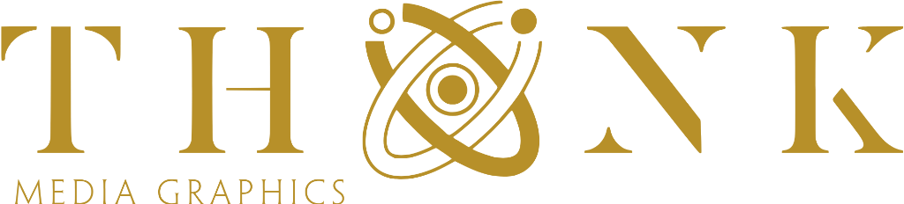
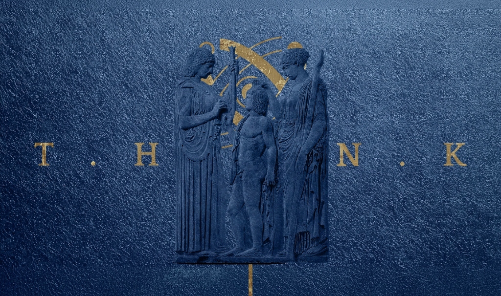
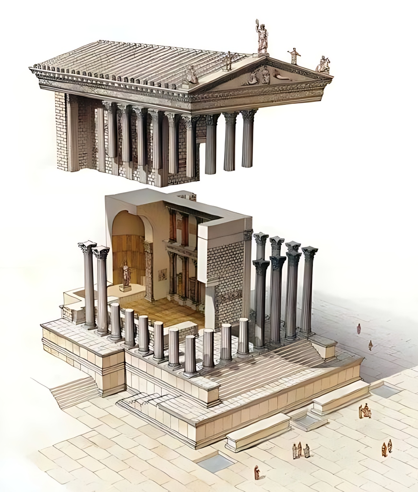
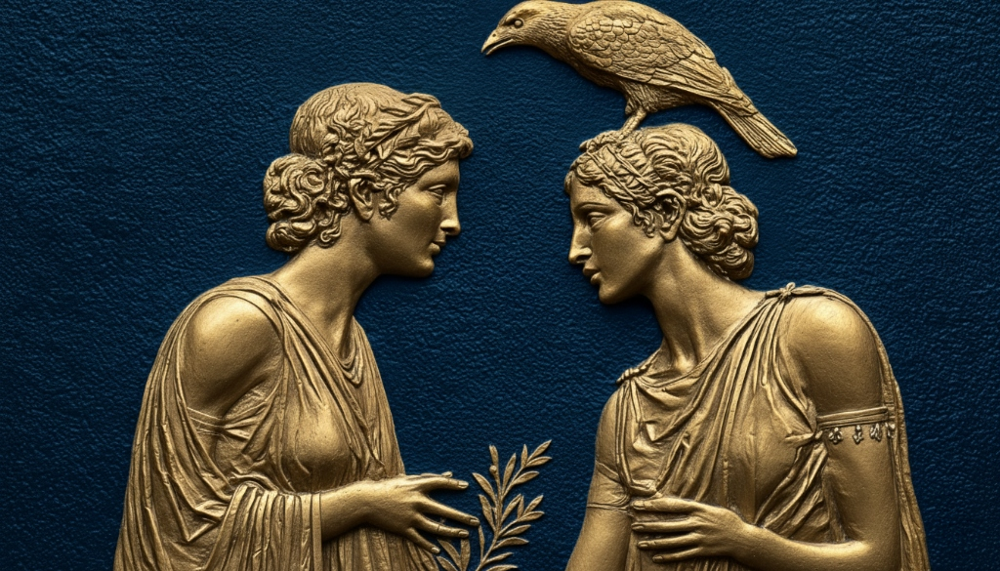

# 2026-thinkmg-brand-guidelines

  

  
  
  
  

---

## 🏛️ Live Brand Guidelines
Explore the fully interactive, responsive brand guidelines website here:
👉 **[View Live Brand Guidelines](https://thiinkmg.github.io/2026-thinkmg-brand-guidelines/)**

---

  

## ✨ About Thiink Media Graphics

At **Thiink Media Graphics**, we operate at the intersection of classical art and cutting-edge digital experiences. We are a premier creative agency specializing in premium brand design, creative direction, high-end illustration, and concept development. 

### How We Strive to Help Our Clients
We believe that design is not just about aesthetics—it is about **communication, authority, and legacy**. 
* **Translating Vision into Reality:** We work closely with visionaries, growing businesses, and entertainment creators to transform raw concepts into striking, cohesive visual identities.
* **Building Trust & Command:** We design visual assets that command attention and instantly build trust with your audience.
* **End-to-End Creative Partnering:** From the initial concept art to the final interactive website, we align every pixel with your brand’s core message.

  

---

## 📐 Purpose of These Brand Guidelines

Consistency is the cornerstone of a strong brand. These guidelines serve as the absolute source of truth for the Thiink Media Graphics brand identity. 

This repository contains the design system, color tokens, typography rules, and asset directories that ensure our identity remains pure, premium, and instantly recognizable across all digital and print mediums.

### Key Visual Pillars
Our brand represents a marriage of **classical Greco-Roman architecture/sculpture** and **modern digital geometry**. 

We utilize:
1. **Classical Proportions:** Architectural drawings, structural cutaways, and classical columns representing stability, structure, and foundational excellence.
2. **Gold Bas-Relief Artistry:** Gold reliefs depicting mythological or allegorical figures on dark, textured blue backgrounds, representing prestige, storytelling, and premium craft.
3. **Gilded Accentuation:** Gold and amber accents (#D4A848 / #BFA15F) contrasted against deep obsidian and slate tones.

  
  &nbsp;&nbsp;
  

---

## 🔗 Notable Links

Connect with us, explore our work, or start a new project:

* 🌐 **Official Website:** [thiinkmediagraphics.com](https://www.thiinkmediagraphics.com/) — Explore our services, agency details, and latest updates.
* 🎨 **Client Portfolios:** [thiinkmediagraphics.com/client-portfolios](https://www.thiinkmediagraphics.com/client-portfolios) — View case studies of brands we've transformed.
* 🚀 **Get Started:** [New Project Form](https://www.thiinkmediagraphics.com/new-project-form) — Ready to elevate your brand? Fill out our brief to start working together.
* 💳 **Pricing Details:** [thiinkmediagraphics.com/pricing](https://www.thiinkmediagraphics.com/pricing) — Transparent pricing structures tailored for diverse projects.
* ✍️ **Our Blog:** [thiinkmediagraphics.com/blog](https://www.thiinkmediagraphics.com/blog) — Insights on branding, graphic design, and creative direction.
* ⭐ **Google Reviews:** [Read Our Reviews](https://www.google.com/search?sxsrf=AE3TifP__9dUaQoYd6-s5kK5MHRKKxX8jw:1766884450569&kgmid=/g/11lfh5jcst&q=Thiink+Media+Graphics&shndl=30&shem=ptotplc,ptotple,shrtsdl&kgs=29c2c78dae709f4a) — See what our clients say about working with us.

---

  © 2026 Thiink Media Graphics. All rights reserved.

